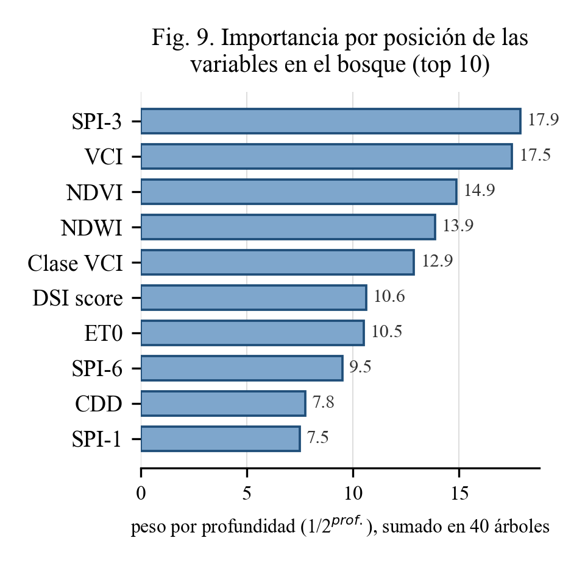

# Sistema de alerta temprana de sequía — Mallacayán (Aija, Áncash, Perú)

Sistema de dos nodos para alerta temprana de sequía en una comunidad altoandina sin conectividad estable: un nodo en Lima (con internet) que adquiere y procesa datos satelitales/climáticos, y un nodo de campo en Mallacayán (ESP32-S3) que fusiona esos datos con un sensor in situ y decide localmente el nivel de alerta con un clasificador Random Forest embebido — sin depender de datos móviles ni Wi-Fi.

Este repositorio cubre las **dos partes con código real y ejecutable** del proyecto: la adquisición satelital en la nube y el modelo de Machine Learning. El firmware completo del nodo (ESP-IDF/C++) es un componente aparte, no incluido aquí.

```
├── lima_cloud/          adquisición real de datos satelitales/climáticos (Google Earth Engine)
└── ml_random_forest/    el clasificador embebido: port a Python + notebook de Colab ejecutable
```

## 1. `lima_cloud/` — adquisición satelital en la nube

Corre como un servicio que, cada 5 días (el ciclo de revisita de Sentinel-2), consulta la API de **Google Earth Engine** y calcula 16 variables por cada uno de los 36 cuadrantes de una grilla 6×6 sobre la cuenca:

| Fuente | Variables |
|---|---|
| Sentinel-2 SR | NDVI, NDWI (Gao 1996), NDDI, tendencia 14 días |
| MODIS MOD11A2 | LST (temperatura superficial) |
| CHIRPS | SPI-1/3/6 (McKee et al. 1993, ajuste gamma), días secos consecutivos |
| ERA5-Land | ET0 (Hargreaves–Samani 1985) |

Cada mensaje se firma con CRC32 (mismo algoritmo que el firmware del nodo) y se publica por HTTP. **La nube solo entrega datos crudos/derivados — nunca calcula si hay sequía o no**, esa decisión es exclusiva del modelo embebido en el ESP32-S3.

Ver [`lima_cloud/README.md`](lima_cloud/README.md) para instalación, cuenta de servicio de Earth Engine y cómo correrlo.

```bash
cd lima_cloud
pip install -r requirements.txt
cp .env.example .env   # completar con tu proyecto/clave de GEE
python -m lima_cloud.main
```

`lima_cloud/compare_local_vs_satellite.py` es el script de validación real usado en el paper: compara 13 días de lectura local del sensor de campo contra ERA5-Land en el mismo punto (sesgo medido: +3.24 °C, sistemático, consistente con la resolución de ~9 km del reanálisis en terreno andino).

## 2. `ml_random_forest/` — el clasificador embebido

El modelo (`drought_onset_model.h`) es un **Random Forest de 40 árboles, profundidad máxima 4, mínimo 30 muestras por hoja**, seleccionado por GridSearch con validación cruzada temporal (`TimeSeriesSplit`, métrica *average precision*), compilado a C++ literal (sin librería de inferencia externa) para correr en el ESP32-S3.

### [`sistema_alerta_sequia_mallacayan.ipynb`](ml_random_forest/sistema_alerta_sequia_mallacayan.ipynb) — notebook ejecutable

[](https://colab.research.google.com/github/GITHUB_USER/GITHUB_REPO/blob/main/ml_random_forest/sistema_alerta_sequia_mallacayan.ipynb)

Corre en Google Colab y hace dos cosas **reales**, sin simular nada:

1. **Adquisición satelital real** contra Google Earth Engine (con tu propia cuenta de Google) para el cuadrante de Mallacayán — el mismo código de `lima_cloud`, adaptado a celdas sueltas.
2. **Inferencia real del Random Forest embebido**: `votesForOnset()` es un port **literal** (si/entonces por si/entonces) de `drought_onset_model.h` — no un modelo reentrenado ni una aproximación.

Como Colab no puede leer el sensor físico BME280 instalado en el nodo, esa lectura se ingresa **manualmente** (última medición real disponible) y se usa solo como validación de plausibilidad frente al dato satelital — igual que hace el firmware real (`sensor_validator.cpp`), nunca como feature cruda del modelo.

### Verificación del port (`feature_vector.cpp`, `drought_onset_model.h`, `feature_importance.py`)

`drought_onset_model.h` es el header compilado tal cual corre en el nodo — se incluye acá como fuente de verdad. `feature_vector.cpp` documenta el orden exacto del vector de 20 variables que espera el modelo.

`feature_importance.py` parsea ese mismo archivo (sin reentrenar nada) y cuenta cuántas veces aparece cada una de las 20 variables como criterio de corte en los 40 árboles, ponderado por profundidad — es la figura de importancia de variables del paper:



El SPI-3 (señal meteorológica) y el VCI (condición de vegetación) concentran el mayor peso, consistente con que el modelo decide principalmente por condición hídrica y no por posición del cuadrante o estacionalidad.

**Cómo se verificó el port a Python** (sin compilador C++ disponible en el entorno de desarrollo): se escribieron dos transpiladores independientes del mismo `.h` (uno por tokenización con expresiones regulares, otro con un parser recursivo por conteo de llaves) y se compararon sus salidas sobre 20 000 vectores aleatorios — 0 discrepancias. Si tenés `g++` a mano, compilar y diffear contra el firmware real es la verificación definitiva y queda como pendiente documentado.

## Honestidad de los datos y resultados

- `dsi_score` y `cur_class` en `lima_cloud` son una heurística propia, documentada como tal — no la fórmula exacta que usó el equipo de ML al entrenar el modelo (ver advertencia en `lima_cloud/lima_cloud/config.py`).
- El notebook de Colab **no reentrena** el modelo: corre el clasificador ya entrenado y compilado. Reentrenar con datos reales de la cuenca (más allá de los vectores sintéticos usados originalmente) sigue pendiente.
- Todos los números reportados en el paper (sesgo local vs. ERA5-Land, costo de inferencia, huella de memoria por modo de firmware) provienen de corridas reales documentadas en este repositorio, no de estimaciones.

## Contexto del proyecto

Trabajo de avance para el paper *"Smart early warning system for preventive water management in high-Andean communities in Peru through the integration of Earth observation, IoT, and TinyML"* (IAC 2026).
